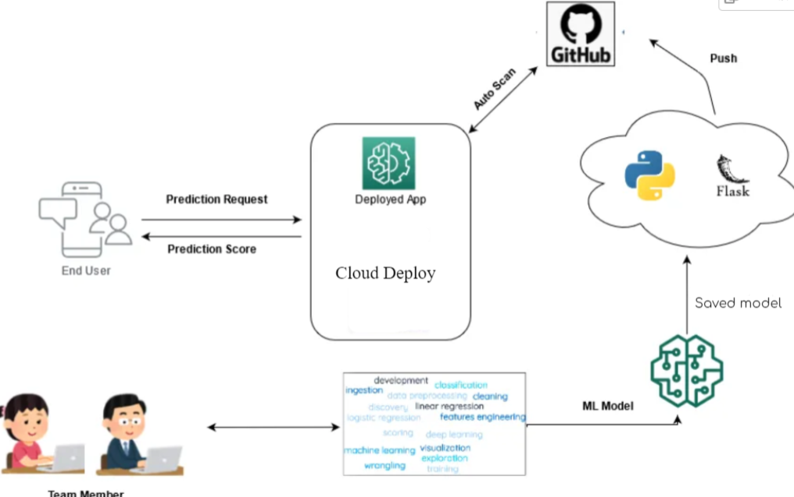
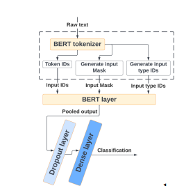

# PHISHING CLASSIFIER


Web3 phishing attacks are a critical issue in the modern blockchain landscape. These
attacks involve the use of deceptive and fraudulent tactics to manipulate users into revealing
their sensitive information, primarily their seed phrases. Seed phrases, also known as
mnemonic phrases or recovery phrases, are sets of words that act as a cryptographic key to
access and control users' wallets and assets within the Web3 ecosystem.
The core problem lies in the fact that users often lack awareness and knowledge about the
security practices required to protect their seed phrases. Phishing attackers exploit this
vulnerability by deploying convincing phishing messages through various communication
channels, including email, social media, messaging apps, and even fake dApps. These
messages typically prompt users to click on malicious links, enter their seed phrases on
counterfeit websites, or share their confidential information.

## Table of Contents

1. [Introduction](#introduction)
2. [Algorithms Used](#ml-dl-algorithms)
3. [Environment Setup](#environment-setup)
4. [Training & Testing ](#training-pipeline)
5. [Flask Application](#flask-application)
6. [Evaluation and Metrics](#evaluation-and-metrics)
7. [Docker Build and Run](#docker)
8. [License](#license)

## Introduction

The rapid evolution of blockchain technology and the rise of decentralized applications
(dApps) have given birth to the Web3 ecosystem. While this technology promises greater
control and ownership over digital assets, it has also introduced new security challenges.
One of the most significant concerns is the prevalence of phishing attacks targeting Web3
users with the intent of obtaining their seed phrases and subsequently draining their wallets
for fraudulent activities.

Here i build an end-to-end training pipeline to train a phishing
message detection model using a web3 phishing dataset, with a Large Language Model.




## Algorithms Used

### BERT Pretrained Model with Fine-Tuning



I Utilized the BERT (Bidirectional Encoder Representations from Transformers) model for our phishing message detection task. BERT is a powerful Large Language Model (LLM) that excels in capturing contextual information and semantic nuances in natural language.

1. Pretrained Model:

I employed a pretrained BERT model, leveraging its knowledge gained from a vast amount of diverse textual data.

2. Fine-Tuning:

To adapt the pretrained BERT model to the specific task of phishing message detection, i performed fine-tuning on our custom web3 phishing dataset. This process involved training the model on our labeled dataset to enhance its ability to recognize phishing patterns within messages.

3. BERT Tokenizer:

In conjunction with the BERT model, i utilized the BERT tokenizer. The tokenizer breaks down input text into subwords and converts them into numerical representations suitable for input into the BERT model.
This combination of a pretrained BERT model, fine-tuning, and the BERT tokenizer allows our algorithm to effectively discern phishing characteristics in messages, providing a robust solution for detecting potential security threats.


## Environment Setup

To ensure a smooth setup of the environment for our phishing message detection model, follow these instructions.

### Prerequisites
1. Python Version:

This project is developed using Python 3.11.4. Please make sure you have Python installed on your system. You can download the latest version from [Python's official website.](https://www.python.org/)

2. Virtual Environment (Optional but Recommended):
It's good practice to create a virtual environment to isolate project dependencies. If you don't have virtualenv installed, you can install it using:

```bash
        pip install virtualenv
```

### Environment Setup Steps
1. Clone the Repository:

Clone this repository to your local machine:

```bash
        git clone https://github.com/{user_name}/Model-Deployment.git

        cd Model-Deployment

```
2. Create and Activate Virtual Environment (Optional):
    Create a virtual environment (recommended but optional):
```bash
      python -m venv venv
```

Activate the virtual environment:

    On Windows:

    ```bash
            .\venv\Scripts\activate
    ```      
    On macOS/Linux:

    ```bash
            source venv/bin/activate
    ```   
3. Install Dependencies:

```bash
    pip install -r requirements.txt
```
## Training & Testing 

Explain the steps to execute the end-to-end training pipeline.

```bash
# Example commands to run the training pipeline
python train.py --arguments
```

To train the model, you need to place the data file inside the DATA folder and specify the file name as an argument along with the number of epochs.Default epoch value is 5.

```bash
# Example 
python train.py DS_test_data.csv --epochs 10
```

## Testing


## Flask Application
```bash
#Example commands to run the Flask application
python app.py 
```


## Evaluation and Metrics

|Metric|Value|

|Precision|	0.866|

|Recall|	0.834|

|F1Score|	0.847|


## Docker Build and Run

```bash
# Example commands to build and run Docker image
docker build -t your-image-name .
docker run -p 5000:5000 your-image-name
```

