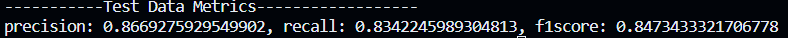

# PHISHING CLASSIFIER


Brief description of your project.

## Table of Contents

1. [Introduction](#introduction)
2. [Deliverables](#deliverables)
3. [Machine Learning / Deep Learning Algorithms](#ml-dl-algorithms)
4. [Clean Coding Practices](#clean-coding-practices)
5. [Reusability and Reproducibility](#reusability-and-reproducibility)
6. [Installation](#installation)
7. [Training Pipeline](#training-pipeline)
8. [Inference](#inference)
9. [Flask Application](#flask-application)
10. [Evaluation and Metrics](#evaluation-and-metrics)
11. [Dependencies](#dependencies)
12. [Docker](#docker)
13. [Contributing](#contributing)
14. [License](#license)

## Introduction

The rapid evolution of blockchain technology and the rise of decentralized applications
(dApps) have given birth to the Web3 ecosystem. While this technology promises greater
control and ownership over digital assets, it has also introduced new security challenges.
One of the most significant concerns is the prevalence of phishing attacks targeting Web3
users with the intent of obtaining their seed phrases and subsequently draining their wallets
for fraudulent activities.

## Deliverables

- Working code for the end-to-end training pipeline using Python scripts.
- Working code for loading the trained model and performing inference using Python scripts.
- Evaluation of the trained model with documented metric results in a README.
- Working code for the Flask application.
- README with instructions on how to execute the training pipeline.
- README on how to run the packaged Flask application.
- A `requirements.txt` file for all dependencies.
- Dockerfile(s) or `docker-compose.yaml` file to start the frontend and backend application.

## Machine Learning / Deep Learning Algorithms

Describe the machine learning or deep learning algorithms you chose and why they are suitable for your task.

## Clean Coding Practices

Explain the coding conventions and practices you followed in your project to ensure readability and maintainability.

## Reusability and Reproducibility

Discuss how your code promotes reusability and reproducibility.

## Installation

Provide instructions on how to install the necessary dependencies and set up the environment.

## Training Pipeline

Explain the steps to execute the end-to-end training pipeline.

```bash
# Example commands to run the training pipeline
python train.py --arguments
```
```bash
#Example commands to run the Flask application
python app.py 
```
## Evaluation and Metrics

Provide the evaluation results and metrics obtained from the trained model.

##Dependencies

List all dependencies with versions in the requirements.txt file.

```bash
##Docker

# Example commands to build and run Docker image
docker build -t your-image-name .
docker run -p 5000:5000 your-image-name
```


